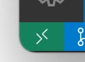

# devboot

## 概要

- Flaskアプリケーションを、VSCodeの拡張機能`Remote Containers`を利用して良い感じに開発するためのテンプレート
- AP-DBの2層アーキテクチャ

## 全体構成


| No  | Function           | Component  | Base Image               | Container Name               |
| --: | ------------------ | ---------- | ------------------------ | ---------------------------- |
|   1 | Application Server | Flask      | python:3.9.10-alpine3.15 | devpython_devcontainer-app-1 |
|   2 | Database Server    | PostgreSQL | postgres:13.5-alpine3.15 | devpython_devcontainer-db-1  |

### アプリケーション構成

| No  | Function        | Component    |  Version |
| --: | --------------- | ------------ | -------: |
|   1 | Python          | Python       |   3.9.10 |
|   2 | Framework       | Flask        |    2.0.2 |
|   3 | Database        | PostgreSQL   |     13.5 |

## 主な設定

### コンテナ上での作業ディレクトリ

接続先での作業ディレクトリの指定を行う。
- `.devcontainer/devcontainer.json`の以下を編集する。

```json
    "workspaceFolder": "/devpython",
```

### VSCodeの拡張機能

接続先での拡張機能設定を行う。  
- `.devcontainer/devcontainer.json`の以下を編集する。
- 必要な拡張機能の`Identifier`を配列として記述する。

```json
    "extensions": [
        "ms-python.python",
        "ms-python.vscode-pylance",
        // omit...
    ]
```

### VSCodeの基本設定

接続先での基本設定の上書きを行う。
- `.devcontainer/devcontainer.json`の以下を編集する。

```json
    "settings": {
        "python.condaPath": "/usr/local/bin/python",
        // omit...
    }
```

## コンテナの起動

1. VSCodeの左下から以下アイコンをクリックし、`Open Folder in Container...`を選択  
   
2. コンテナのビルドが開始されるので、しばらく待つ
3. VSCode内でコンテナ上のディレクトリが開かれる

## アプリケーション開発

### 事前準備

```sh
pip install -r requirements.txt --no-cache-dir
```

#### pip installをDockerfileに組み込む場合

`requirements.txt`を`.devcontainer`ディレクトリ直下にコピーして、

```dockerfile
ADD requirements.txt
RUN pip install -r requirements.txt --no-cache-dir
```

を追記する。

#### psycopg2を手動インストールする場合

Dockerfileから以下の`RUN`をコメントアウトして、コンテナ起動後に以下を手動実行

```sh
apk add --no-cache postgresql-libs
apk add --no-cache --virtual .build-deps gcc=10.3.1_git20211027-r0 musl-dev=1.2.2-r7 postgresql-dev=13.5-r1
pip install psycopg2=2.9.3 --no-cache-dir   # ここで`pip install -r requirements.txt --no-cache-dir`でもOK
apk --purge del .build-deps
```

### テスト

ルートディレクトリ上で以下コマンドを実行

```sh
pytest -v --cache-clear --flake8 --html=htmlcov/test-report.html --cov=src --cov-report=html
```

### 実行

ルートディレクトリ上で以下コマンドを実行

```sh
python src/app.py
```

接続先URL: http://localhost/users

## Reference

- [devcontainer.json reference](https://code.visualstudio.com/docs/remote/devcontainerjson-reference)
